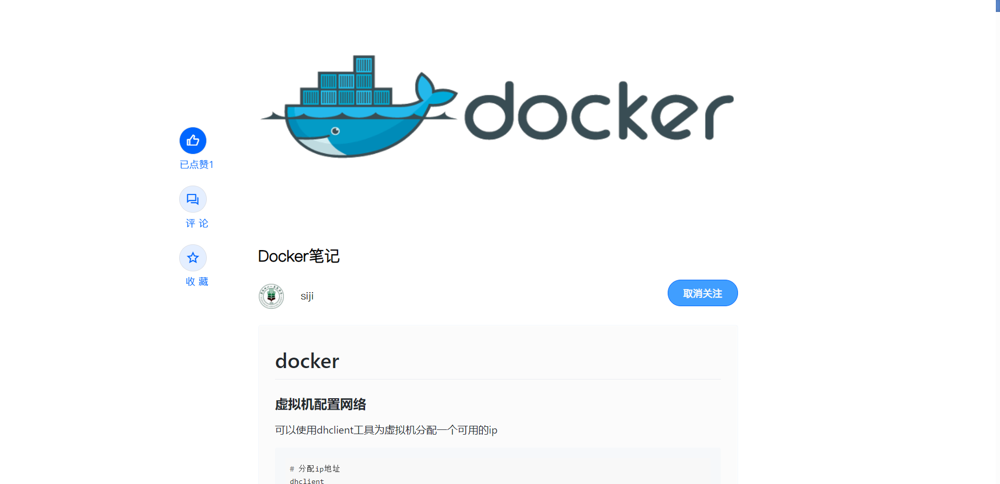

### 新版肆记 前后端分离版版本

#### 技术选型
##### 后端
- SpringBoot 2.4.0
- MySQL 8.0
- Mybatis-Plus 3.4.0
- Druid连接池
- Redis
- 榛子云短信验证平台
- hutool和其他一些东西就不过多的赘述了
- 后续应该会整合RabbitMQ做一些消息推送

##### 前端
- Vue 2 
- ElementUI
- mavonEditor
- axios
- vue-pdf

#### 页面效果
本来考虑的是没登陆也可以查看文章的，做到一半发现前端好像有点完不成，只能换一个方案了。
>先放几张图吧

如果你觉得这个项目对你有帮助，请帮忙点一个Star