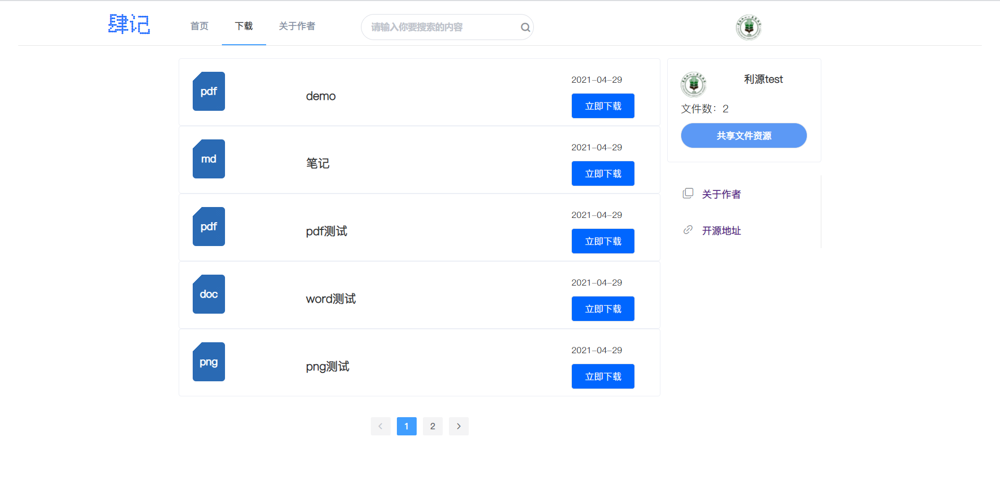
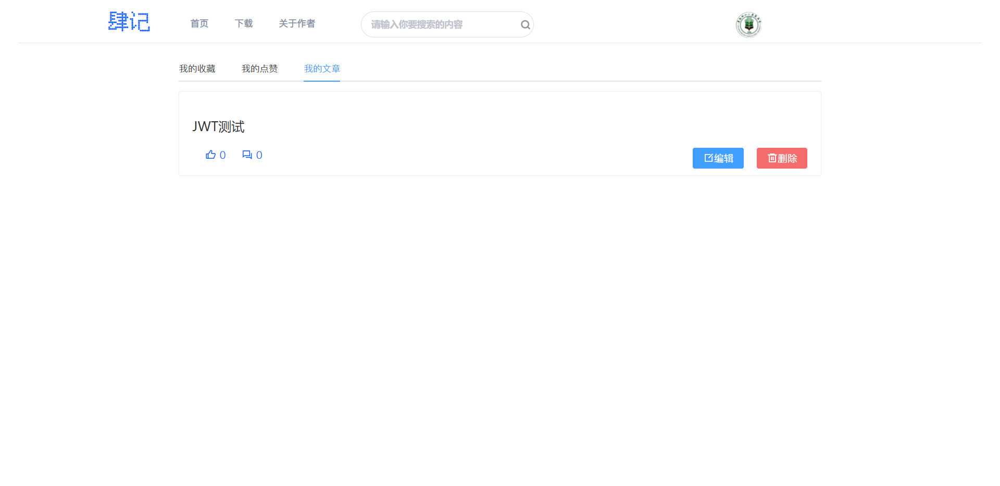

### 新版肆记 前后端分离版版本
>本项目类似CSDN博客，支持保存文章和文件，采用前后端分离开发，用到的技术相对简单，用于本人前端不是特别好，所以前端充满了妥协。

前端地址

#### 技术选型
##### 后端
- SpringBoot 2.4.0
- MySQL 8.0
- Mybatis-Plus 3.4.0
- Druid连接池
- Redis
- Swagger2.0
- 榛子云短信验证平台
- hutool和其他一些东西就不过多的赘述了
- 后续应该会整合RabbitMQ做一些消息推送

##### 前端
- Vue 2 
- ElementUI
- mavonEditor
- axios
- vue-pdf

#### 部署教程
**后端:**
- 导入数据库文件
- 修改后端项目的配置文件，修改数据库配置
- 配置Redis地址
- 修改后端项目的配置文件中的本地图片地址和本地文件存储地址
- 运行

**前端：**

-  `npm install`
- `npm run dev`

>前提是本地要有node的环境
#### 页面效果
本来考虑的是没登陆也可以查看文章的，做到一半发现前端好像有点完不成，只能换一个方案了。
>先放几张图吧
##### 账号免密登录

##### 手机号快速登录/注册

##### 首页

##### 文章详情页

##### 文章评论

##### 保存文章

##### 收藏文章

##### 修改密码及个人基本信息

##### 分类查看文章

##### 上传下载文件

##### 我的主页-我的收藏

##### 我的主页-我的点赞

##### 我的主页-我的文章

如果你觉得这个项目对你有帮助，请帮忙点一个Star